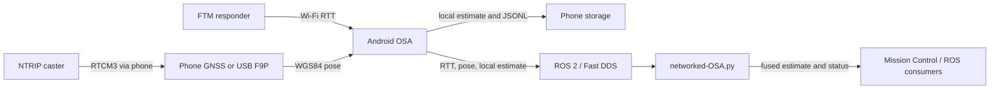

# RTT-SearchAgent

RTT-SearchAgent is an Android and ROS 2 system for locating IEEE 802.11mc
Fine Timing Measurement (FTM) responders from one or more moving search
agents. Each One Search Agent (OSA), normally a phone carried by a drone,
combines Wi-Fi RTT ranges with GNSS poses, estimates responder positions,
publishes live ROS 2 telemetry, and records field logs. Multiple OSAs can be
fused online by the central Networked-OSA node.

This repository intentionally contains only the maintained application and
runtime source, the ROS Android build artifacts required by the APK, and two
documentation files. Experimental datasets, rosbags, plots, offline-analysis
code, and manuscripts are not part of this repository.

> [!WARNING]
> This is research software for controlled experiments. It is not a flight
> controller, navigation aid, or emergency-response safety system.

## What Is Included

| Component | Purpose |
|---|---|
| `app/` | Android 11+ Wi-Fi RTT application with GNSS, NTRIP, local estimation, ROS 2, and JSONL logging |
| `runtime/online/networked-OSA.py` | The only supported central online fusion algorithm |
| `tools/adb_remote.py` | Mission Control GUI for ADB setup, ROS 2 control, NTRIP, ground truth, maps, and log collection |
| `tools/record_dual_dds_rosbag.sh` | Optional synchronized Fast DDS and Cyclone DDS rosbag recorder |
| `docs/TECHNICAL.md` | Architecture, interfaces, estimator behavior, parameters, security, and troubleshooting |

The high-level data path is:



## Supported Environment

### Android OSA

| Requirement | Current value |
|---|---|
| Android | Android 11 / API 30 or newer |
| Compile and target SDK | API 34 |
| Device capability | `android.hardware.wifi.rtt` |
| Native ROS ABI | `arm64-v8a` |
| Tested GNSS receiver | u-blox ZED-F9P over USB OTG at 115200 baud |

The manifest allows installation on a phone without Wi-Fi RTT so that device
support can be checked at runtime. Verify every field phone before deployment:

```bash
adb -s <serial> shell pm list features | grep android.hardware.wifi.rtt
adb -s <serial> shell getprop ro.product.cpu.abi
```

The application prefers fresh external USB GNSS fixes while the receiver is
active and returns to Android fused location when external GNSS stops. An F9P
with a valid RTK solution is strongly recommended for quantitative 3D work.
Do not mix altitude datums within one run.

### Ground station

- Linux with Git, Git LFS, ADB, Tk, and Python 3.10 or newer.
- JDK 17 or 21 and Android SDK 34 for APK builds.
- ROS 2 with `rclpy`, `std_msgs`, `std_srvs`, and optionally `sensor_msgs`.
- `rmw_fastrtps_cpp` for direct interoperability with the bundled Android ROS
  runtime. The current integration has been exercised with ROS 2 Lyrical.

Gradle 8.4 and Android Gradle Plugin 8.3.2 are pinned by the repository. JDK 25
is not supported by this Gradle version.

## Clone, Build, And Install

The Android Fast DDS library is stored with Git LFS. Pull it before building:

```bash
git lfs install
git clone https://github.com/jbravoMlg/rtt-ftm-localization-ros2.git
cd rtt-ftm-localization-ros2
git lfs pull

file app/src/main/jniLibs/arm64-v8a/libfastrtps.so
```

The last command must report an ARM64 ELF shared object, not an ASCII Git LFS
pointer.

Configure a supported JDK and Android SDK, run the unit suite, and assemble the
debug APK:

```bash
export JAVA_HOME=/path/to/jdk-17-or-21
export ANDROID_HOME="$HOME/Android/Sdk"

./gradlew testDebugUnitTest
./gradlew assembleDebug
```

Install on a specific device, especially when several phones are attached:

```bash
adb devices -l
adb -s <serial> install -r app/build/outputs/apk/debug/app-debug.apk
```

On first launch, grant precise location, nearby Wi-Fi, notification, and USB
permissions as requested. Keep the application visible while confirming that
Wi-Fi RTT, GNSS, ROS 2, and log status are healthy.

## Ground-Station Setup

Install system packages first. Package names below are for Debian/Ubuntu:

```bash
sudo apt install adb git-lfs python3-tk python3-venv
python3 -m venv --system-site-packages .venv
source .venv/bin/activate
python -m pip install --upgrade pip
python -m pip install -r requirements.txt
```

`--system-site-packages` allows a distro-installed ROS 2 Python stack to remain
visible. Source ROS 2 in every terminal that will use Mission Control or the
fusion node:

```bash
source /opt/ros/<distro>/setup.bash
export ROS_LOCALHOST_ONLY=0
export RMW_IMPLEMENTATION=rmw_fastrtps_cpp
export ROS_DOMAIN_ID=0

python3 tools/adb_remote.py
```

Mission Control automatically re-executes under `.venv/bin/python` when that
environment exists. The map tab uses `tkintermapview`; the remaining controls
still start if that optional map backend is unavailable.

Runtime files are kept outside the checkout:

| Variable | Default | Purpose |
|---|---|---|
| `RTT_GUI_DATA_ROOT` | `~/.local/share/rtt-searchagent` | Ground truth, fusion logs, and rosbag sessions |
| `RTT_GUI_RMW_IMPLEMENTATION` | `rmw_fastrtps_cpp` | RMW used by ROS subprocesses launched by Mission Control |

For example:

```bash
RTT_GUI_DATA_ROOT=/mnt/field-data/mission-01 python3 tools/adb_remote.py
```

## Field Workflow

### 1. Prepare each OSA

1. Connect the phone and, when used, the F9P through USB OTG.
2. Open RTT-SearchAgent and accept the USB permission prompt.
3. Confirm that Wi-Fi RTT is available and GNSS fixes are fresh.
4. Connect the phone and ground station to the same trusted DDS network or VPN.
5. Keep all devices on the same `ROS_DOMAIN_ID` and a compatible Fast DDS RMW.

Mission Control can use USB ADB directly. For ADB over a trusted network, enable
TCP mode once while the phone is connected by USB:

```bash
adb -s <serial> tcpip 5555
adb connect <trusted-phone-ip>:5555
```

Disable or firewall ADB TCP after the operation. Never expose port 5555 to the
public Internet.

### 2. Configure the experiment

In Mission Control, use **Experiment Config** to set a unique label, altitude
mode, optional range-bias calibration, estimator filter, and cooperative OSA
fields.

For a single OSA:

- use `cooperative_mode=independent`;
- keep a unique `agent_id`, or allow the app to derive one from the device;
- central Networked-OSA fusion is not required because the phone publishes its
  own per-anchor estimates.

For two or more OSAs:

- assign stable IDs such as `osa1`, `osa2`, and `osa3`;
- use `cooperative_mode=fused_offboard`;
- use the same ranging period and distribute phase offsets across that period;
- restart each Android app after changing `agent_id`, because ROS topic names
  are created at startup.

For two OSAs at a 240 ms period, phases 0 ms and 120 ms are a practical starting
point. Avoid flat or stationary trajectories: the default Android `auto`
altitude mode requires at least 3 m of observed vertical spread before its 3D
bootstrap, while horizontal motion is needed for useful multilateration
geometry.

### 3. Configure GNSS and optional NTRIP

Use Mission Control's **NTRIP** tab rather than command-line arguments so that
caster credentials do not enter shell history. Send the configuration to the
intended phone, connect, and verify increasing RTCM byte counts and RTK quality
before takeoff. Standalone or fused phone GNSS can operate as a fallback, but
its uncertainty directly increases the effective range variance.

### 4. Register optional ground truth

The **Ground Truth** tab can send one surveyed AP position to one or all phones.
Mission Control also auto-loads:

```text
~/.local/share/rtt-searchagent/reference/ground_truth.csv
```

Override the root with `RTT_GUI_DATA_ROOT`. CSV rows use this order; comments
starting with `#`, an optional header, and an empty altitude are accepted:

```csv
bssid,lat,lon,alt,description
aa:bb:cc:dd:ee:ff,36.000000,-4.000000,42.5,surveyed responder
```

Ground truth is for evaluation and display. It is not required by either online
estimator.

### 5. Start online fusion

For a cooperative run, start **Multi-OSA** in Mission Control. It launches the
only maintained central node, `runtime/online/networked-OSA.py`, and stores
fusion JSONL logs under the user data root.

The equivalent manual command is:

```bash
source /opt/ros/<distro>/setup.bash
export ROS_LOCALHOST_ONLY=0
export RMW_IMPLEMENTATION=rmw_fastrtps_cpp
export ROS_DOMAIN_ID=0

RUN_DIR="${RTT_GUI_DATA_ROOT:-$HOME/.local/share/rtt-searchagent}/fusion_logs/run_$(date +%Y%m%d_%H%M%S)"
python3 runtime/online/networked-OSA.py \
  --require-n-osa 2 \
  --require-n-osa-publish 2 \
  --pose-source auto \
  --z-mode auto \
  --log-dir "$RUN_DIR"
```

The node dynamically discovers OSA namespaces. Its default bootstrap requires
two distinct OSAs, at least six RTT observations, and 15 m of horizontal
position spread. The ENU origin is not accepted until a pose reports
`0 < accuracy <= 2 m`; with phone poses this normally means waiting for a good
GNSS/RTK solution.

### 6. Run and stop the mission

1. Press **Discover UAVs (ROS 2)** and confirm every expected namespace.
2. Check that location and RTT controls are visible and current.
3. Press **START ALL** only after the flight platform is ready.
4. Fly trajectories with useful horizontal and vertical diversity.
5. Monitor per-OSA and fused estimates in **AP Estimates** and **Map**.
6. Press **STOP ALL** before disconnecting phones or receivers.
7. Stop **Multi-OSA** and verify that its process exits cleanly.
8. Pull phone logs with the **Logs** tab before clearing remote storage.

## Manual ADB Control

Mission Control is the preferred interface. The same non-secret experiment
configuration can be sent explicitly:

```bash
adb -s <serial> shell am broadcast \
  -a com.jbravo.osa_ftm.EXPERIMENT_CONFIG \
  -p com.jbravo.osa_ftm \
  --es label "run_001" \
  --es agl "15.0" \
  --es altitude_mode "auto" \
  --es range_bias "0.0" \
  --es filter "BASELINE" \
  --es agent_id "osa1" \
  --es cooperative_mode "fused_offboard" \
  --es ranging_period_ms "240" \
  --es ranging_phase_ms "0"

adb -s <serial> shell am broadcast \
  -a com.jbravo.osa_ftm.REMOTE_CMD \
  -p com.jbravo.osa_ftm \
  --es cmd "start"

adb -s <serial> shell am broadcast \
  -a com.jbravo.osa_ftm.REMOTE_CMD \
  -p com.jbravo.osa_ftm \
  --es cmd "stop"
```

Valid Android filter names are `BASELINE`, `NLOS`, `EMPIRICAL_R`, `UKF`, `EMA`,
and `ADAPTIVE_R`. The full ADB and ROS 2 contracts are in
[docs/TECHNICAL.md](docs/TECHNICAL.md).

## ROS 2 Overview

For each Android namespace `<agent>`, the primary interfaces are:

| Name | Type | Direction |
|---|---|---|
| `/<agent>/ftm_rtt` | `std_msgs/String` JSON | Android publishes |
| `/<agent>/phone/location` | `std_msgs/Float64MultiArray` | Android publishes |
| `/<agent>/ftm/anchor/<ap>/estimate` | `std_msgs/Float64MultiArray` | Android publishes stable estimates |
| `/<agent>/ftm/anchor/<ap>/state` | `std_msgs/Float64MultiArray` | Android publishes intermediate state |
| `/<agent>/ftm/command` | `std_msgs/String` | Android subscribes |
| `/<agent>/ftm/set_agl` | `std_msgs/Float64MultiArray` | Android subscribes |
| `/<agent>/ftm/start_experiment` | `std_srvs/Trigger` | Android serves |
| `/<agent>/ftm/stop_experiment` | `std_srvs/Trigger` | Android serves |

Networked-OSA publishes:

- `/fusion/anchor/<ap>/estimate` for stable 2D or 3D fused estimates;
- `/fusion/anchor/<ap>/state` for the current estimator state;
- `/fusion/status` for a JSON summary of discovered OSAs and tracked anchors.

## Logs And Rosbags

Android writes into its app-specific external storage when available:

```text
/sdcard/Android/data/com.jbravo.osa_ftm/files/ftm_logs/
```

The main files are `experiment.jsonl`, `gps.jsonl`, `rtt.jsonl`, `mlat.jsonl`,
`mlat_state.jsonl`, `app.jsonl`, and `status.json`. Mission Control pulls them
to timestamped, per-device folders under `~/ftm_logs` by default.

Networked-OSA writes `fusion_state.jsonl` and `fusion_mlat.jsonl` only when
`--log-dir` is set. These files can contain precise trajectories, network IDs,
and responder identifiers; store them as sensitive field data.

When DDS discovery differs between Fast DDS and Cyclone DDS, the optional
recorder starts one process per RMW and groups both bags into one session:

```bash
source /opt/ros/<distro>/setup.bash
tools/record_dual_dds_rosbag.sh --duration 300
```

Its default output is outside the checkout under
`~/.local/share/rtt-searchagent/rosbags/dual_dds/`. Run the script with `--help`
for topic filters, storage backends, and RMW overrides.

## Validation

Run the checks relevant to a change before field deployment:

```bash
export JAVA_HOME=/path/to/jdk-17-or-21
export ANDROID_HOME="$HOME/Android/Sdk"
./gradlew testDebugUnitTest
./gradlew assembleDebug

python3 -m py_compile tools/adb_remote.py runtime/online/networked-OSA.py
bash -n tools/record_dual_dds_rosbag.sh

source /opt/ros/<distro>/setup.bash
RMW_IMPLEMENTATION=rmw_fastrtps_cpp \
  python3 runtime/online/networked-OSA.py --help
```

APK compilation cannot detect missing JNI symbols. Changes to the bundled ROS
Java/JNI runtime must also be tested on a physical ARM64 phone.

## Security And Data Policy

- Never commit NTRIP usernames or passwords, VPN credentials, private field
  coordinates, device identities tied to people, or collected logs.
- Use NTRIP credentials interactively in Mission Control and rotate them if
  they appear in shell history, logs, screenshots, or Git history.
- Restrict ADB TCP and DDS to a trusted network or VPN. ROS 2 discovery and the
  application topics do not provide an application-level authorization layer.
- Review pulled logs before sharing; they include trajectories, timestamps,
  BSSIDs, and experiment metadata.
- The repository ignores common rosbag, JSONL, campaign, and generated-output
  paths to reduce accidental publication. Keep acquisition data outside the
  source checkout anyway.

## Troubleshooting

| Symptom | Check |
|---|---|
| `libfastrtps.so` is a small text file | Run `git lfs pull` and verify it with `file` |
| Gradle fails early on a new JDK | Use JDK 17 or 21; Gradle 8.4 does not support JDK 25 |
| App installs but no RTT is available | Verify `android.hardware.wifi.rtt`, location/Wi-Fi permissions, and an FTM responder |
| Mission Control finds no OSAs | Match `ROS_DOMAIN_ID`, source ROS 2, use Fast DDS, disable `ROS_LOCALHOST_ONLY`, and check the VPN/firewall |
| Fusion says it is waiting for ENU origin | Supply a pose with reported accuracy at or below 2 m |
| Horizontal estimates appear but altitude does not converge | Add vertical trajectory diversity and keep altitude datums consistent |
| Map tab is unavailable | Activate `.venv` and install `requirements.txt`; Tk itself must come from the OS |
| NTRIP connects but RTCM bytes stay at zero | Check host, port, mountpoint, credentials, Internet access, and caster policy |

More detailed diagnostics and all message layouts are in
[docs/TECHNICAL.md](docs/TECHNICAL.md).

## License And Citation

The software is distributed under the [MIT License](LICENSE). Citation metadata
is provided in [CITATION.cff](CITATION.cff).