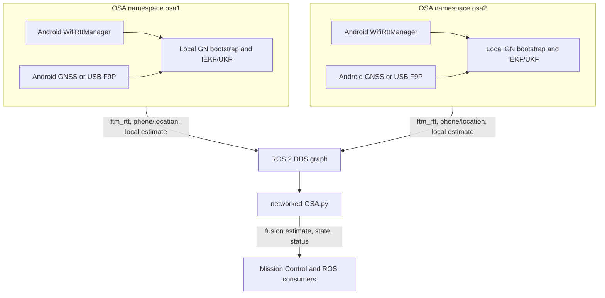

# RTT-SearchAgent Technical Reference

This document is the maintained technical reference for the Android OSA,
Mission Control, and the online Networked-OSA fusion node. The root
[README](../README.md) is the operational quick start.

The repository does not include historical datasets, campaign-specific code,
offline-analysis pipelines, plots, or manuscripts. Keep field data outside the
source checkout.

## 1. System Architecture

An OSA is one Android phone and its carrier, usually a drone. The phone ranges
to IEEE 802.11mc responders, time-associates each range with a GNSS pose, and
runs a local per-responder estimator. ROS 2 makes raw observations and local
estimates available to the ground station. Networked-OSA combines observations
from independent namespaces into one estimate per responder.



### Ownership boundaries

| Path | Responsibility |
|---|---|
| `app/src/main/` | Android UI, acquisition, GNSS/NTRIP, local estimation, ROS 2, and logging |
| `app/src/test/` | Android/JVM unit tests |
| `app/libs/` | Local ros2-java and ROS message Java artifacts required by Gradle |
| `app/src/main/jniLibs/arm64-v8a/` | Matching ROS 2 and Fast DDS Android native runtime |
| `runtime/online/networked-OSA.py` | Central online multilateration and publication |
| `tools/adb_remote.py` | Operator GUI and process control |
| `tools/record_dual_dds_rosbag.sh` | Optional dual-RMW capture helper |

## 2. Build And Runtime Baseline

### Android toolchain

| Item | Pinned value |
|---|---|
| Gradle wrapper | 8.4 |
| Android Gradle Plugin | 8.3.2 |
| Kotlin plugin | 1.9.0 |
| `compileSdk` / `targetSdk` | 34 |
| `minSdk` | 30 |
| Java/Kotlin bytecode target | 1.8 |
| Supported build JDK | 17 or 21 |
| Android ROS native ABI | `arm64-v8a` |

Build and unit-test commands:

```bash
export JAVA_HOME=/path/to/jdk-17-or-21
export ANDROID_HOME="$HOME/Android/Sdk"

./gradlew testDebugUnitTest
./gradlew assembleDebug
```

Gradle compilation is not a complete ROS runtime test. JNI symbol resolution,
DDS discovery, USB behavior, Wi-Fi RTT permissions, and foreground-service
lifecycle must be checked on a physical ARM64 phone.

### Bundled ROS Android artifacts

`app/build.gradle.kts` explicitly links these Java artifacts:

- `rcljava.jar` and `rcljava_common.jar`;
- `commons-lang3-3.7.jar`;
- `slf4j-api-1.7.21.jar` and `slf4j-android-1.7.21.jar`;
- `std_msgs_messages.jar` and `std_srvs_messages.jar`;
- `builtin_interfaces_messages.jar`, `rcl_interfaces_messages.jar`,
  `rmw_dds_common_messages.jar`, and `rosgraph_msgs_messages.jar`.

Gradle also loads every AAR in `app/libs/`. The Java artifacts and all shared
libraries under `app/src/main/jniLibs/arm64-v8a/` must come from one compatible
ROS 2/ros2-java build. Replacing only part of the set can compile successfully
and then fail with missing classes or JNI symbols.

`libfastrtps.so` is stored with Git LFS. Validate it after cloning:

```bash
git lfs pull
file app/src/main/jniLibs/arm64-v8a/libfastrtps.so
```

The packaging rules exclude several unused benchmark, test, and message
libraries from the APK. If a new ROS message package is introduced, verify that
its type support is not excluded and test it on-device.

### Ground-station Python and ROS 2

Both Python programs require Python 3.10 or newer. Mission Control otherwise
uses the standard library, Tk from the operating system, and the optional map
package in `requirements.txt`. Networked-OSA depends on ROS 2 Python packages,
not PyPI replacements.

```bash
sudo apt install adb python3-tk python3-venv
python3 -m venv --system-site-packages .venv
source .venv/bin/activate
python -m pip install -r requirements.txt

source /opt/ros/<distro>/setup.bash
export RMW_IMPLEMENTATION=rmw_fastrtps_cpp
export ROS_LOCALHOST_ONLY=0
```

Fast DDS is the expected RMW for interoperability with the bundled Android
runtime. All participants must use the same `ROS_DOMAIN_ID`.

## 3. Android Acquisition

### Permissions and capabilities

The manifest declares fine/coarse/background location, Wi-Fi state, nearby
Wi-Fi, Internet, wake lock, notification, foreground location service,
Bluetooth-name access, and USB host support. Wi-Fi RTT and USB host are marked
optional at install time, so installation alone does not prove that a phone is
suitable.

```bash
adb -s <serial> shell pm list features | grep android.hardware.wifi.rtt
adb -s <serial> shell getprop ro.product.cpu.abi
```

Android can range only to scan results whose `is80211mcResponder` property is
true. One request includes at most ten responders. The default gap between
ranging bursts is 120 ms, and Wi-Fi scan results are refreshed every 3 seconds.

### GNSS selection and synchronization

The app maintains a rolling GNSS buffer and associates RTT observations with a
nearby or interpolated pose. The default synchronization window is 1200 ms and
can be changed at runtime from 10 to 30000 ms. Android rejects poses whose
reported accuracy is greater than 15 m for local estimation.

When a USB receiver is active and has delivered a fresh fix within 5 seconds,
its fix takes precedence. If the external receiver stops, Android fused
location resumes. A low-accuracy fallback is useful operationally but can make
the 3D solution unsuitable for quantitative evaluation.

### External u-blox GNSS and NTRIP

`ExternalGnssManager`:

1. discovers a USB serial device and requests permission;
2. opens the port at 115200 baud;
3. sends UBX configuration for a 100 ms navigation period (10 Hz) and GGA;
4. validates and parses NMEA GGA fixes;
5. optionally starts an NTRIP client and writes received RTCM3 bytes back to
   the same serial port.

The NTRIP client uses the configured host, port, mountpoint, username, and
password and reconnects after failures. Credentials are persisted in Android
preferences when configured through the application. Treat the phone as a
secret-bearing device and clear or rotate credentials before transferring it.

For reliable RTK, confirm all of the following before acquisition:

- current GGA fixes are arriving at the expected rate;
- fix quality and reported accuracy are appropriate for the experiment;
- RTCM byte counts increase after NTRIP connects;
- the antenna has a suitable sky view and ground plane;
- every source uses a compatible altitude datum.

## 4. Android Estimation Pipeline

Each responder has an independent track. The local processing order is:

1. log and publish the raw RTT observation;
2. require a synchronized GNSS pose with acceptable reported accuracy;
3. subtract configured `range_bias` and clamp the range to zero;
4. apply the rolling median/MAD range gate;
5. convert the phone pose from WGS84 to local ENU;
6. choose the filter-specific measurement variance and add GNSS position
   uncertainty in quadrature;
7. bootstrap a 3D responder position with robust Gauss-Newton;
8. update an IEKF or UKF for each accepted range;
9. publish intermediate state once per second;
10. publish a stable estimate only after covariance, sample, jump, and streak
    checks pass.

### Robust range gate

`RobustRttGate` has these defaults:

| Parameter | Value |
|---|---|
| Rolling window | 1500 ms |
| Maximum observations | 30 |
| Warm-up observations | 8 |
| MAD multiplier | 3.5 |
| Robust sigma floor | 0.12 m |

After warm-up, the robust scale is

$$
\sigma_{robust} = \max(1.4826\,MAD,\ 0.12)
$$

and an observation is accepted when

$$
|r_i - \operatorname{median}(r)| \le 3.5\,\sigma_{robust}.
$$

The effective range sigma also includes GNSS uncertainty:

$$
\sigma_{effective} = \sqrt{\sigma_{RTT}^{2} + \sigma_{GNSS}^{2}}.
$$

### Bootstrap, filters, and convergence

The Android bootstrap requires at least eight accepted samples. In
`altitude_mode=auto`, it additionally requires 3 m of vertical pose spread and
does not apply a fixed AGL prior. In `manual_agl`, the configured AGL contributes
a loose ground-height prior.

The default IEKF state is `[E, N, U, bias]`; the responder is modeled as nearly
static and the range bias as a slow random walk. IEKF updates use three
iterations and a normalized innovation gate of 9. The UKF mode uses its own 3D
state and sigma-point update.

| Filter mode | Range gate | Variance model | Estimator | Output smoothing |
|---|---|---|---|---|
| `BASELINE` | MAD | robust sigma | IEKF3D | 2D median, window 7 |
| `NLOS` | MAD plus NLOS evidence | inflated under likely NLOS | IEKF3D | 2D median, window 7 |
| `EMPIRICAL_R` | MAD | function of distance and RSSI | IEKF3D | 2D median, window 7 |
| `UKF` | MAD | robust sigma | UKF3D | 2D median, window 7 |
| `EMA` | MAD | robust sigma | IEKF3D | EMA, alpha 0.3 |
| `ADAPTIVE_R` | MAD | innovation-adaptive variance | IEKF3D | 2D median, window 7 |

Stable local publication requires at least 10 or 15 accepted updates depending
on the convergence streak, horizontal sigma below 2.5 m, vertical sigma below
8 m, bounded motion since the previous publication, and consecutive stable
checks. These covariance thresholds are estimator confidence indicators, not a
guarantee of absolute accuracy.

### Coordinate frames

External interfaces use latitude, longitude, and altitude. Estimators use a
local East-North-Up frame whose origin is set from a GNSS pose. The conversion
uses an Earth-radius local approximation, appropriate for the limited spatial
extent of a field experiment but not a replacement for a global geodesic
library.

Altitude is the most fragile coordinate. Phone fused altitude, NMEA altitude,
drone telemetry altitude, and surveyed ground truth may use ellipsoidal, MSL,
or application-specific datums. A run must use one understood convention.

## 5. Android ROS 2 Interface

All relative names below are prefixed by `/<agent>/`. A configured `agent_id`
is sanitized to lower-case alphanumeric characters and underscores, with a
maximum length of 32. If no ID is configured, the app derives a device-specific
namespace. Changing `agent_id` requires an app restart before ROS names change.

### Publications

| Topic | Type | Payload |
|---|---|---|
| `/<agent>/ftm_rtt` | `std_msgs/String` | JSON RTT observation |
| `/<agent>/phone/location` | `std_msgs/Float64MultiArray` | `[lat, lon, alt, accuracy_m, timestamp_ms]` |
| `/<agent>/ftm/anchor/<ap>/estimate` | `std_msgs/Float64MultiArray` | `[lat, lon, alt, cov_xx, cov_yy, cov_xy, n_samples, bssid_hash]` |
| `/<agent>/ftm/anchor/<ap>/state` | `std_msgs/Float64MultiArray` | `[lat, lon, alt, sigma_h, sigma_z, n_accepted, converged, bssid_hash]` |

The responder topic ID is `ap_` plus the normalized 12-hex-digit BSSID. Stable
estimates and intermediate states have different layouts; consumers must not
interpret one as the other.

The RTT JSON contains additional diagnostics, but Networked-OSA relies on these
fields:

| Field | Meaning |
|---|---|
| `bssid` | Responder identity |
| `distance_m` | Measured range |
| `sigma_used_m` or `std_m` | Range uncertainty; `sigma_used_m` has priority |
| `accepted` | Optional local acceptance flag; defaults to true |
| `t_ms` | Wall-clock timestamp in milliseconds |
| `t_mono_ms` | Monotonic timestamp when available |

### Subscriptions

| Topic | Type | Accepted data |
|---|---|---|
| `/<agent>/ftm/command` | `std_msgs/String` | `start`, `stop`, `wls`, `huber`, `trim`, `sigmaclip`, and supported runtime commands |
| `/<agent>/ftm/set_agl` | `std_msgs/Float64MultiArray` | `[agl_m]` |

When peer mode is enabled and `peer_agent_id` is set, the app also subscribes
to `/<peer>/phone/location` and `/<peer>/ftm_rtt`. `fused_onboard` peer
estimation is experimental; the maintained multi-agent workflow is
`fused_offboard` with Networked-OSA.

### Services

All services use `std_srvs/Trigger`:

| Service | Effect |
|---|---|
| `/<agent>/ftm/start_experiment` | Reset/start acquisition and logging |
| `/<agent>/ftm/stop_experiment` | Stop and write summaries |
| `/<agent>/ftm/set_weighting_wls` | Select WLS |
| `/<agent>/ftm/set_weighting_huber` | Select Huber weighting |
| `/<agent>/ftm/set_weighting_trim` | Select trimmed weighting |
| `/<agent>/ftm/set_weighting_sigmaclip` | Select sigma clipping |

Mission Control prefers the namespaced command topic and falls back to ADB and
then services when necessary.

## 6. ADB Interface

The application registers exported runtime receivers for four package-scoped
actions. Always include `-s <serial>` when several devices are connected.

### `com.jbravo.osa_ftm.EXPERIMENT_CONFIG`

All extras are strings:

| Extra | Meaning | Default/current behavior |
|---|---|---|
| `label` | Human-readable run ID | Empty |
| `agl` | OSA height above responder/ground in metres | 1.5; used by `manual_agl` |
| `altitude_mode` | `auto` or `manual_agl` | `auto` |
| `range_bias` | Known metres subtracted from each RTT range | 0.0 |
| `notes` | Operator notes | Empty |
| `filter` | Android filter enum | `BASELINE` |
| `agent_id` | This OSA's stable ID | Device-derived when empty |
| `peer_agent_id` | Optional peer namespace | Empty |
| `cooperative_mode` | `independent`, `fused_offboard`, or `fused_onboard` | `independent` |
| `ranging_period_ms` | Minimum gap between bursts | 120 |
| `ranging_phase_ms` | First-burst phase offset | 0 |

Example:

```bash
adb -s <serial> shell am broadcast \
  -a com.jbravo.osa_ftm.EXPERIMENT_CONFIG \
  -p com.jbravo.osa_ftm \
  --es label "run_001" \
  --es altitude_mode "auto" \
  --es filter "BASELINE" \
  --es agent_id "osa1" \
  --es cooperative_mode "fused_offboard" \
  --es ranging_period_ms "240" \
  --es ranging_phase_ms "0"
```

### `com.jbravo.osa_ftm.REMOTE_CMD`

Send one `cmd` string. Supported controls include:

- `start` and `stop`;
- `set_weighting:WLS`, `set_weighting:HUBER`, `set_weighting:TRIM`, and
  `set_weighting:SIGMACLIP`;
- `set_sync_window:<milliseconds>` for values from 10 to 30000;
- `get_status` to refresh `status.json`;
- `ntrip_connect` and `ntrip_disconnect`.

```bash
adb -s <serial> shell am broadcast \
  -a com.jbravo.osa_ftm.REMOTE_CMD \
  -p com.jbravo.osa_ftm \
  --es cmd "get_status"
```

### `com.jbravo.osa_ftm.GROUND_TRUTH`

Required string extras are `bssid`, `lat`, `lon`, and `alt`; optional
`description` is stored with the surveyed responder. Ground truth is evaluation
metadata and does not seed the estimator.

### `com.jbravo.osa_ftm.NTRIP_CONFIG`

String extras are `host`, `port`, `mountpoint`, `user`, and `pass`. `host` is
required and the default port is 2101. Prefer Mission Control for this action so
credentials do not enter shell history. Never place real values in scripts,
documentation, issue reports, or Git.

## 7. Networked-OSA Online Fusion

`runtime/online/networked-OSA.py` is the only supported central fusion
implementation.

### Discovery and inputs

At 0.2 Hz by default, the node scans the ROS graph and dynamically subscribes
to matching namespaces:

| Pattern | Type | Use |
|---|---|---|
| `/<ns>/ftm_rtt` | `std_msgs/String` | Accepted RTT observations |
| `/<ns>/phone/location` | `std_msgs/Float64MultiArray` | Phone pose `[lat, lon, alt, acc, t_ms]` |
| `/<ns>/location` | `sensor_msgs/NavSatFix` or `std_msgs/Float64MultiArray` | Optional drone pose |
| `/<ns>/ftm/anchor/<ap>/estimate` | `std_msgs/Float64MultiArray` | Optional cross-initialization from a mature phone estimate |

Subscriptions use best-effort QoS, keep-last depth 50. In `pose-source=auto`,
fresh drone telemetry is preferred and phone GNSS is the fallback. Phone poses
whose positive reported accuracy exceeds `--gnss-acc-max` are dropped.

The ENU origin has a stricter fixed requirement: its first pose must report
`0 < accuracy <= 2 m`. `NavSatFix` drone input is assigned 0.5 m by the current
adapter. If the node repeatedly reports that it is waiting for RTK quality, no
anchor processing can begin.

### Estimator behavior

For every BSSID, the node:

1. subtracts the configured known range bias;
2. applies a rolling robust RTT gate;
3. checks the number of distinct contributing OSAs and trajectory geometry;
4. runs a robust 3D Gauss-Newton bootstrap;
5. initializes an IEKF with `[E, N, U]` plus one range-bias state per OSA;
6. applies WLS, Huber, trim, or sigma-clip robust weighting;
7. tracks NIS, residual RMSE, rejected updates, and per-OSA bias;
8. resets a diverged track when configured thresholds are sustained;
9. evaluates horizontal and vertical stability independently;
10. publishes 2D-stable output by default even if 3D stability has not yet
    been reached.

The per-OSA bias model prevents one phone's systematic range offset from being
forced onto every other OSA. `--range-bias` is a known global correction applied
before those residual bias states are estimated.

### Publications

| Topic | Type | Payload |
|---|---|---|
| `/fusion/anchor/<ap>/estimate` | `std_msgs/Float64MultiArray` | `[lat, lon, alt, cov_xx, cov_yy, cov_xy, n_accepted, sigma_h, sigma_z, stable_2d, stable_3d, n_osa]` |
| `/fusion/anchor/<ap>/state` | `std_msgs/Float64MultiArray` | `[lat, lon, alt, sigma_h, sigma_z, n_accepted, stable_2d, stable_3d]` |
| `/fusion/status` | `std_msgs/String` | JSON global status, published every 2 seconds |

The status JSON includes discovered OSA names, responder counts, contributing
OSAs, accepted/rejected counts, resets, covariance indicators, residual RMSE,
ENU state, and estimated bias per OSA.

### Command-line options

Run `python3 runtime/online/networked-OSA.py --help` after sourcing ROS 2 for
the authoritative parser output.

| Option | Default | Meaning |
|---|---:|---|
| `--min-samples` | 6 | Minimum RTT observations for Gauss-Newton bootstrap; internally at least 4 |
| `--z-mode` | `auto` | `auto`, `fixed_agl`, or `none` vertical handling |
| `--agl-hint` | 0.0 | OSA height above responder used by `fixed_agl` and as an auto fallback |
| `--range-bias` | 0.0 | Known metres subtracted before gating and residual bias estimation |
| `--sigma-threshold` | 2.5 | Horizontal stability threshold in metres |
| `--sigma-z-threshold` | 20.0 | Vertical stability threshold in metres |
| `--gnss-acc-max` | 5.0 | Drop phone poses with worse positive reported accuracy |
| `--z-prior-sigma` | 10.0 | Initial vertical-prior sigma |
| `--z-prior-min-sigma` | 5.0 | Asymptotic vertical-prior sigma; internally at least 0.5 |
| `--log-dir` | none | Directory for fusion JSONL files |
| `--discover-hz` | 0.2 | ROS graph discovery frequency |
| `--reset-on-divergence` | enabled | Reset after sustained rejection/NIS divergence |
| `--no-reset-on-divergence` | n/a | Disable divergence reset |
| `--divergence-reject-streak` | 8 | Consecutive rejects required; internally at least 3 |
| `--divergence-nis-mean` | 6.0 | Mean NIS reset threshold; internally at least 1 |
| `--robust-method` | `sigma_clip` | `wls`, `huber`, `trim`, or `sigma_clip` |
| `--robust-param` | 2.5 | Huber k, trim fraction, or sigma-clip k, depending on method |
| `--require-n-osa` | 2 | Distinct OSAs required for bootstrap |
| `--require-n-osa-publish` | 2 | Distinct OSAs required for publish; internally never below bootstrap requirement |
| `--min-spread-m` | 15.0 | Minimum 2D trajectory bounding-box diagonal |
| `--min-vertical-spread-m` | 0.0 | Explicit minimum vertical trajectory spread |
| `--pose-source` | `auto` | `phone`, `drone`, or `auto` |
| `--no-publish-2d-only` | off | Require 3D stability before publishing estimates |

Vertical modes are intentionally distinct from Android's configuration:

- Networked `auto` infers initial altitude from range geometry and does not use
  a fixed AGL prior;
- `fixed_agl` applies the `drone_z - agl_hint` prior;
- `none` disables synthetic vertical priors.

### Mission Control launch defaults

Mission Control exposes a focused subset of node options. Its initial values
are AGL hint 10 m, known bias 0 m, horizontal sigma threshold 2.5 m, six
bootstrap samples, GNSS accuracy limit 5 m, initial z-prior sigma 5 m, and
divergence reset at reject streak 8 or mean NIS 6.0. Options not exposed in the
GUI retain the node parser defaults above.

## 8. Mission Control

Run the maintained entrypoint from the repository root:

```bash
source /opt/ros/<distro>/setup.bash
RMW_IMPLEMENTATION=rmw_fastrtps_cpp python3 tools/adb_remote.py
```

Mission Control contains these active views:

1. About / quick start;
2. Mission Control for ADB and ROS discovery/start/stop;
3. Experiment Config;
4. NTRIP and phone status;
5. Ground Truth;
6. Multi-OSA process control;
7. AP Estimates;
8. live map;
9. phone log management.

There is no offline rosbag-analysis view. The GUI does not import deleted
analysis modules.

### Environment and persistence

| Setting | Default |
|---|---|
| `RTT_GUI_RMW_IMPLEMENTATION` | `rmw_fastrtps_cpp` |
| `MOBILE_RMW_IMPLEMENTATION` fallback | Used only when the first variable is absent |
| `RTT_GUI_DATA_ROOT` | `${XDG_DATA_HOME:-$HOME/.local/share}/rtt-searchagent` conceptually; Python default is `~/.local/share/rtt-searchagent` |
| GUI preferences | `~/.config/rtt_searchagent.json` |
| Ground-truth auto-load | `$RTT_GUI_DATA_ROOT/reference/ground_truth.csv` |
| Fusion logs | `$RTT_GUI_DATA_ROOT/fusion_logs` |
| Pulled phone logs | `~/ftm_logs` by default |

If `.venv/bin/python` exists, the script re-executes itself there while
preserving the sourced ROS environment. This avoids mixing incompatible Tk
stacks and still exposes ROS packages through `--system-site-packages` and the
ROS environment variables.

### Ground-truth CSV

The auto-loaded CSV order is:

```csv
bssid,lat,lon,alt,description
```

The header is optional. Lines whose first non-space character is `#` are
ignored, altitude may be empty and becomes 0.0, and description is optional.
The **Push ground_truth.csv** control copies a selected file to the Android
application's external files directory.

## 9. Logs And Capture

### Android files

`FileLogger` writes asynchronously to external app storage when available and
private internal storage otherwise. The normal externally accessible path is:

```text
/sdcard/Android/data/com.jbravo.osa_ftm/files/ftm_logs/
```

| File | Main content |
|---|---|
| `experiment.jsonl` | Start/stop, clock checks, ground truth, accuracy, and geometry summaries |
| `gps.jsonl` | Local and peer GNSS observations |
| `rtt.jsonl` | Local and peer RTT observations |
| `mlat_state.jsonl` | Intermediate local estimator state |
| `mlat.jsonl` | Stable local estimates |
| `app.jsonl` | Application events |
| `status.json` | Latest ADB-readable status snapshot |

The logger flushes periodically, uses a bounded queue, and tracks dropped
entries. Stop the experiment cleanly before disconnecting power, then pull and
verify files before clearing the phone.

### Networked-OSA files

When `--log-dir` is set:

- `fusion_state.jsonl` records states, innovations, NIS, bias estimates,
  resets, stability flags, and contribution metadata;
- `fusion_mlat.jsonl` records published fused estimates and covariance fields.

No log directory means no fusion files are written.

### Dual-RMW rosbag capture

One process cannot use two RMW implementations simultaneously. The optional
script starts synchronized Fast DDS and Cyclone DDS recorders, captures graph
snapshots, and writes a manifest:

```bash
tools/record_dual_dds_rosbag.sh --duration 300 --storage sqlite3
```

By default, sessions are written below
`$RTT_GUI_DATA_ROOT/rosbags/dual_dds`, or
`~/.local/share/rtt-searchagent/rosbags/dual_dds` when the variable is unset.
Use `--output-root` for mounted field storage. `mcap`, repeated `--topic`
filters, domain overrides, split size, and RMW-specific configuration are
available through `--help`.

## 10. Security And Privacy

### NTRIP credentials

- Enter credentials interactively; do not place them in tracked files or shell
  scripts.
- Remember that Android preferences retain the current configuration.
- Redact screenshots and support logs.
- Rotate credentials immediately if they enter Git history or a shared log.

### ADB

- Prefer USB for setup.
- Use ADB TCP only on an isolated trusted network or VPN with firewall rules.
- Select a serial explicitly before sending configuration or deleting logs.
- Disable network ADB and revoke unneeded host authorizations after field work.

### ROS 2 and DDS

These application topics do not add an authorization layer. Any participant
that can join the DDS domain may observe trajectories or send control messages.
Use network isolation, VPN controls, and ROS 2 security facilities appropriate
to the deployment.

### Data handling

RTT logs and rosbags can expose precise trajectories, timestamps, BSSIDs,
network topology, and operator/device associations. Store them outside the
repository with access controls and an explicit retention policy. The
`.gitignore` rules are a final guard, not the primary data boundary.

## 11. Validation Checklist

### Source checks

```bash
python3 -m py_compile tools/adb_remote.py runtime/online/networked-OSA.py
bash -n tools/record_dual_dds_rosbag.sh
git diff --check
```

### Android checks

```bash
export JAVA_HOME=/path/to/jdk-17-or-21
export ANDROID_HOME="$HOME/Android/Sdk"
./gradlew testDebugUnitTest
./gradlew assembleDebug
adb -s <serial> install -r app/build/outputs/apk/debug/app-debug.apk
```

On-device, verify USB reconnect, internal/external GNSS handoff, NTRIP byte
flow, continuous RTT, local estimate publication, clean stop, and log pull.

### ROS 2 checks

```bash
source /opt/ros/<distro>/setup.bash
export RMW_IMPLEMENTATION=rmw_fastrtps_cpp
export ROS_LOCALHOST_ONLY=0

python3 runtime/online/networked-OSA.py --help
ros2 topic list -t
ros2 topic echo /fusion/status
```

For a live multi-OSA test, verify that each expected namespace contributes RTT
and pose messages, that the origin is established, and that `n_drones`,
`n_accepted`, stability flags, and bias values evolve plausibly.

## 12. Troubleshooting

### Android build

| Problem | Resolution |
|---|---|
| Gradle reports unsupported Java | Select JDK 17 or 21 |
| `libfastrtps.so` is text or tiny | Run `git lfs pull`; reclone with Git LFS if needed |
| Build succeeds but ROS crashes on phone | Check that all JAR/AAR/SO artifacts came from the same build and inspect `adb logcat` for missing symbols |
| App cannot install/run ROS on device | Confirm `arm64-v8a` |

### Android acquisition

| Problem | Resolution |
|---|---|
| No RTT responders | Confirm phone RTT support, permissions, Wi-Fi state, and responder FTM capability |
| No USB GNSS | Reconnect OTG, accept permission, check cable/power and USB serial detection |
| GNSS is present but estimator does not start | Check pose age, synchronization window, and reported accuracy |
| Local Z never initializes in `auto` | Fly at least 3 m of vertical spread and maintain horizontal geometry |
| Large consistent range residual | Calibrate `range_bias`; do not copy an assumed value from another device |

### ROS 2 and fusion

| Problem | Resolution |
|---|---|
| Mission Control discovers no OSAs | Match domain, source ROS, select Fast DDS, set `ROS_LOCALHOST_ONLY=0`, and check multicast/VPN/firewall behavior |
| RTT topic exists but fusion accepts nothing | Verify matching pose timestamps, positive distance/sigma, and the `accepted` field |
| Fusion waits for ENU origin | Supply one pose with `0 < accuracy <= 2 m` |
| Bootstrap never occurs | Check distinct OSA count, at least six samples, 15 m horizontal spread, pose availability, and robust-gate rejection |
| Only 2D becomes stable | Improve vertical geometry, inspect altitude datums, or deliberately require 3D with `--no-publish-2d-only` |
| Repeated resets | Inspect NIS, residual RMSE, range bias, pose source, and timing before relaxing divergence thresholds |

### Mission Control

| Problem | Resolution |
|---|---|
| Tk import fails | Install the OS `python3-tk` package |
| Map tab reports missing backend | Activate `.venv` and install `requirements.txt` |
| ADB reports unauthorized | Unlock the phone and accept the host authorization prompt |
| ADB reports device offline | Reconnect USB/TCP and run `adb devices -l` |
| Multi-OSA exits immediately | Read its captured output; confirm ROS was sourced and `rclpy` is importable in the selected interpreter |

## 13. Extension Rules

- Keep `runtime/online/networked-OSA.py` as the single supported fusion
  entrypoint; update Mission Control and both documents when its CLI changes.
- Add ROS message packages as complete Java and native type-support sets.
- Preserve namespace and array-layout compatibility, or version the topic
  contract explicitly.
- Put datasets, bags, generated figures, sweeps, and campaign notebooks in a
  separate data/reproducibility repository.
- Add focused unit tests for estimator changes and repeat an ARM64 hardware
  smoke test for ROS/JNI, Wi-Fi RTT, USB, or service lifecycle changes.